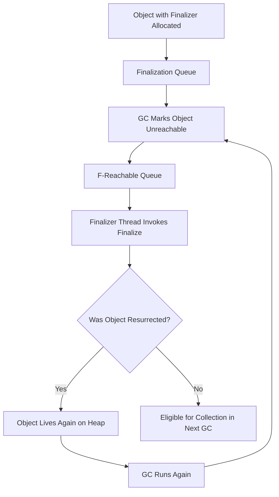

# .NET Garbage Collection: Finalization Flow

- **Finalization Queue**
- **F-Reachable Queue**.

---

## 🧠 Overview

- Objects with a finalizer (`~ClassName()`) are placed in the **Finalization Queue**.
- When the object becomes unreachable, it is moved to the **F-Reachable Queue**.
- The **Finalizer Thread** calls `Finalize()`.
- After finalization, the object is eligible for collection unless it is resurrected.

---

## 🗺️ Mermaid Diagram

